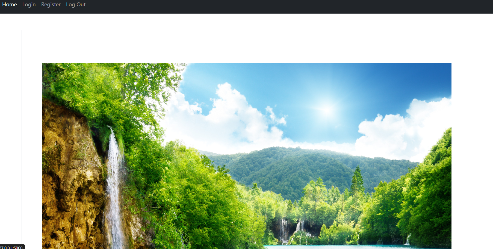

  # User Login Page and Dashboard
  
This project features a user login page that allows new user registration and access to a secure dashboard. The dashboard displays an artifacts folder containing a variety of files organized into different subfolders, which users can download as needed.
  
  


  ## Installation
  
  Clone the Repository and create an environment
  
  ```bash
   pip install -r requirements.txt
   python app.py
  ```
      

## Features

- User Registration

- User Login

- Access to Secure Dashboard

- Display and Download Files from the Artifacts Folder
  


  ## Screenshots
  - Home Page
  
  

  - New User Registration Page
  

  - Login Page
  

  - Dashboard Page
  

  - Artifacts Page
  
  


  ## Authors
  
  - [@Shubham Rawat](https://www.github.com/rawatshubham09)
  
  ## License
  [](https://choosealicense.com/licenses/mit/)
  [MIT](https://choosealicense.com/licenses/mit/)
  
  
